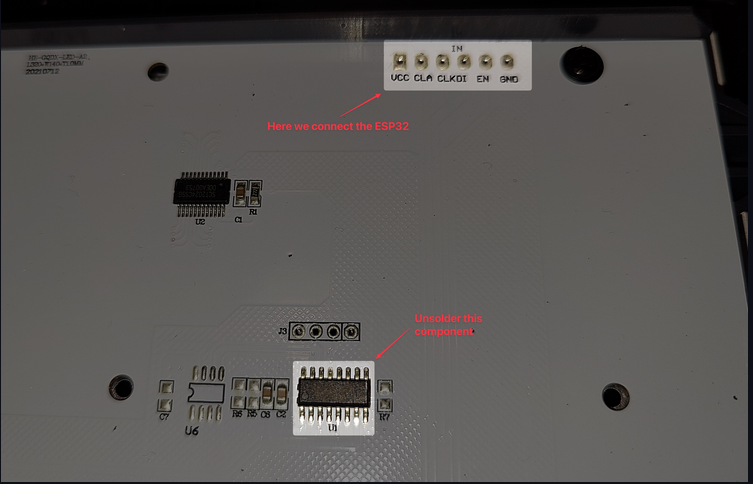

# 

## Materialien
### Was muss gemacht werden
- ESP32 Dev Board anbringen
-  Mikrocontroller entfernen
### ESP32 Dev Board
Auf der Rückseite unten gibt es 6 Stecker am Rand. Dort wird das ESP32 Dev Board verbunden. 
###  Mikrocontroller
Oberhalb des angebrachtren ESP32 Dev Board muss der Mikrocontroller entfernt werden, da dort das alte Standartprogramm oben ist.

### Bild für Mikrocontroller und ESP32 Dev Board

### Github Repository
https://github.com/ph1p/ikea-led-obegraensad 