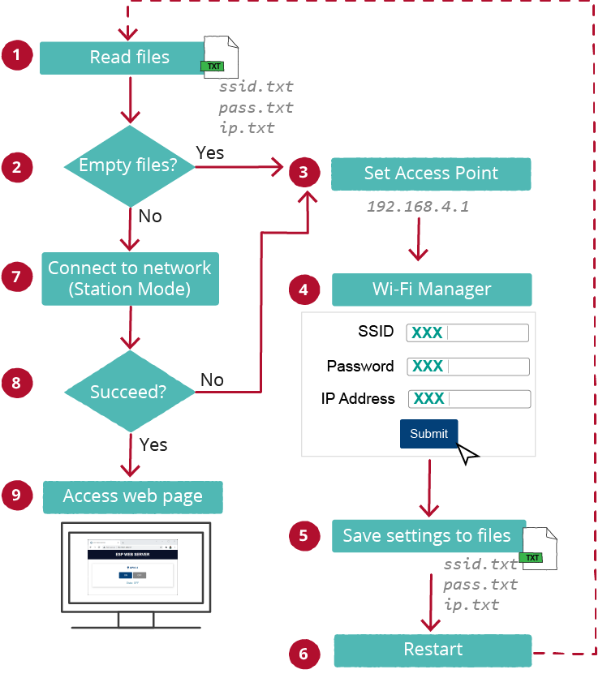

# Wifi-Manager
## Was passiert

- Wenn das ESP anfängt, versucht es, diessid.txt,pass.txtundip.txtDateien zu lesen(1);

- Wenn die Dateien leer sind 2(2) (das erste Mal, wenn Sie die Board ausführen, sind die Dateien leer), wird Ihr Board als Access Point 3(3) festgelegt.

- Mit jedem WLAN-fähigen Gerät mit einem Browser können Sie sich mit dem neu erstellten Access Point verbinden (StandardnameESP-WIFI-MANAGER);

- Nach dem Aufbau einer Verbindung mit dem ESP-WIFI-MANAGER können Sie zur Standard-IP-Adresse gehen 192.168.4.1 eine Webseite zu öffnen, mit der Sie Ihre SSID und Ihr Passwort konfigurieren können (4);

- Die im Formular eingefügte SSID-, Passwort- und IP-Adresse werden in den entsprechenden Dateien gespeichert:ssid.txt, pass.txt, 
undip.txt(5);

- Danach startet der ESP-Vorstand 6 neu (6);

- Dieses Mal sind die Dateien nach dem Neustart nicht leer, so dass das ESP versucht, sich mit dem Netzwerk im Stationsmodus zu verbinden, indem Sie die Einstellungen verwenden, die Sie in das Formular eingefügt haben 7(7).

- Wenn es eine Verbindung aufstellt, wird der Prozess erfolgreich abgeschlossen und Sie können auf die Hauptserverseite zugreifen, die alles tun kann, was Sie wollen (Steuersensoren, Steuerausgänge, Anzeige von Text usw.) (9). Andernfalls wird der Access Point (3), und Sie können auf die Standard-IP-Adresse zugreifen (192.168.4.1) eine weitere SSID/Passwort-Kombination hinzuzufügen.