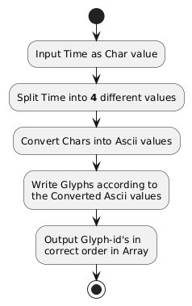

## Die Idee
Man nutzt die Ascii-werte der zahlen als Id der Glyphen sommit kann man 
einen Array von den zu schreibenden Glyphen erstellen den man dan mithilfe 
eines anderen darauf abgestimmten Prozesses auf den Bildschirm ausgeben kann.

## Ascii-Tabelle
| Dec | Chr | Dec    | Chr   | Dec    | Chr   | Dec | Chr | Dec     | Chr   |
| --- | --- | ------ | ----- | ------ | ----- | --- | --- | ------- | ----- |
| 0   | NUL | 26     | SUB   | **52** | **4** | 78  | N   | **104** | **h** |
| 1   | SOH | 27     | ESC   | **53** | **5** | 79  | O   | 105     | i     |
| 2   | STX | 28     | FS    | **54** | **6** | 80  | P   | 106     | j     |
| 3   | ETX | 29     | GS    | **55** | **7** | 81  | Q   | 107     | k     |
| 4   | EOT | 30     | RS    | **56** | **8** | 82  | R   | 108     | l     |
| 5   | ENQ | 31     | US    | **57** | **9** | 83  | S   | 109     | m     |
| 6   | ACK | 32     |       | 58     | :     | 84  | T   | 110     | n     |
| 7   | BEL | 33     | !     | 59     | ;     | 85  | U   | 111     | o     |
| 8   | BS  | 34     | "     | 60     | <     | 86  | V   | 112     | p     |
| 9   | HT  | 35     | #     | 61     | =     | 87  | W   | 113     | q     |
| 10  | LF  | 36     | $     | 62     | >     | 88  | X   | 114     | r     |
| 11  | VT  | 37     | %     | 63     | ?     | 89  | Y   | 115     | s     |
| 12  | FF  | 38     | &     | 64     | @     | 90  | Z   | 116     | t     |
| 13  | CR  | 39     | '     | 65     | A     | 91  | [   | 117     | u     |
| 14  | SO  | 40     | (     | 66     | B     | 92  | \|  | 118     | v     |
| 15  | SI  | 41     | )     | 67     | C     | 93  | ]   | 119     | w     |
| 16  | DLE | 42     | *     | 68     | D     | 94  | ^   | 120     | x     |
| 17  | DC1 | 43     | +     | 69     | E     | 95  | _   | 121     | y     |
| 18  | DC2 | 44     | ,     | 70     | F     | 96  | `   | 122     | z     |
| 19  | DC3 | 45     | -     | 71     | G     | 97  | a   | 123     | {     |
| 20  | DC4 | 46     | .     | 72     | H     | 98  | b   | 124     |       |
| 21  | NAK | 47     | /     | 73     | I     | 99  | c   | 125     | }     |
| 22  | SYN | **48** | **0** | 74     | J     | 100 | d   | 126     | ~     |
| 23  | ETB | **49** | **1** | 75     | K     | 101 | e   | 127     | DEL   |
| 24  | CAN | **50** | **2** | 76     | L     | 102 | f   |
| 25  | EM  | **51** | **3** | 77     | M     | 103 | g   |

## Quellen
- 09.01.2025, Planttext, [www.planttext.com](https://www.planttext.com)
- 09.01.2025, Asciitable, [www.asciitable.com](https://www.asciitable.com)